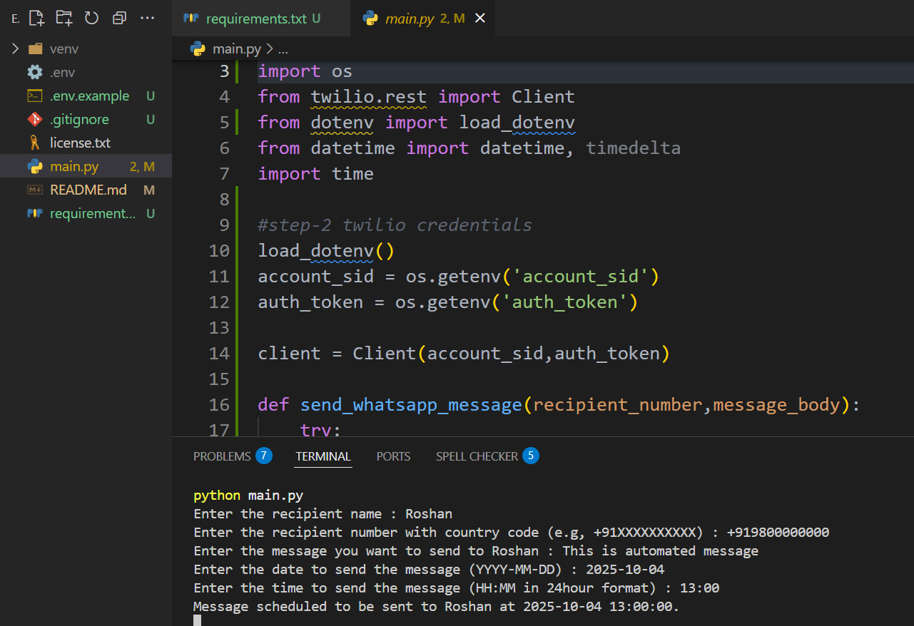

# WhatsApp Message Automation

Automate sending WhatsApp messages using Python and Twilio API. This project allows users to send messages instantly or schedule them for future delivery to any WhatsApp contact.

## Features

- Send WhatsApp messages instantly to any contact
- Schedule messages for future date and time
- Easy integration with Twilio API
- Simple and user-friendly Python scripts

## Requirements

- Python 3.x
- Twilio account and API credentials
- Required Python packages (see `requirements.txt`)

## Installation

1. Clone the repository:
    ```bash
    git clone https://github.com/roshan-metrix/whatsapp-message-automation.git
    cd whatsapp-message-automation
    ```
2. Install dependencies:
    ```bash
    pip install -r requirements.txt
    ```

## Usage

1. Configure your Twilio credentials in the script.
2. Run the script to send or schedule WhatsApp messages:
    ```bash
    python main.py
    ```

## Screenshots


## License
This project is licensed under the [MIT License](license.txt).

